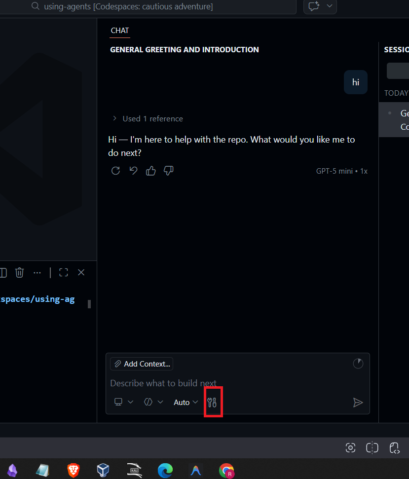
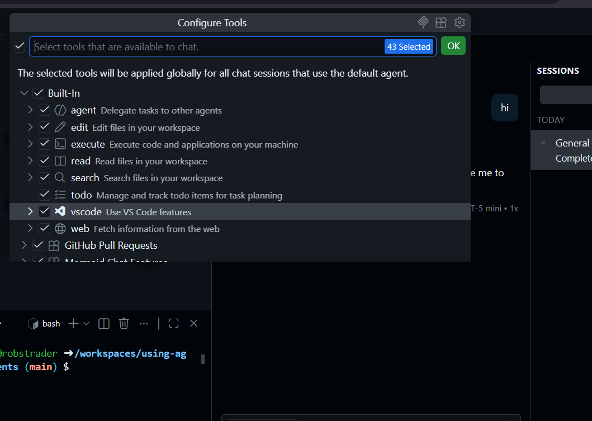
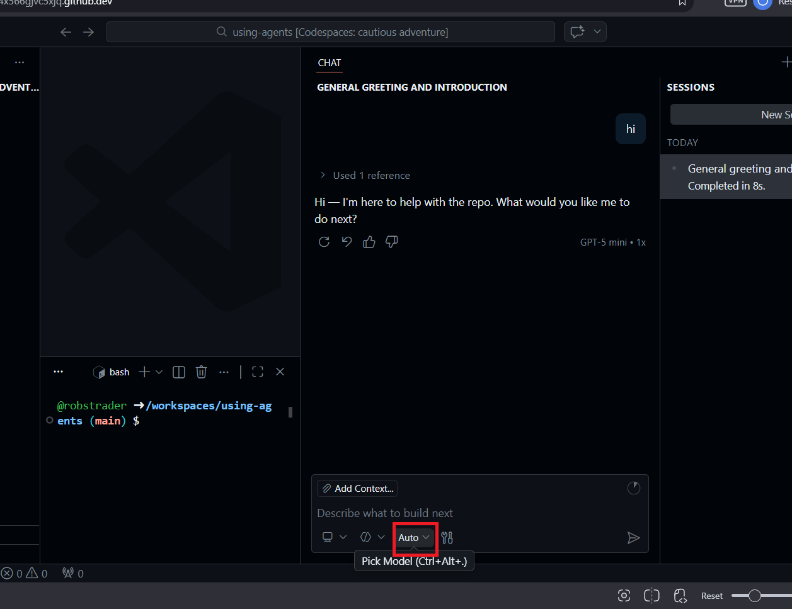
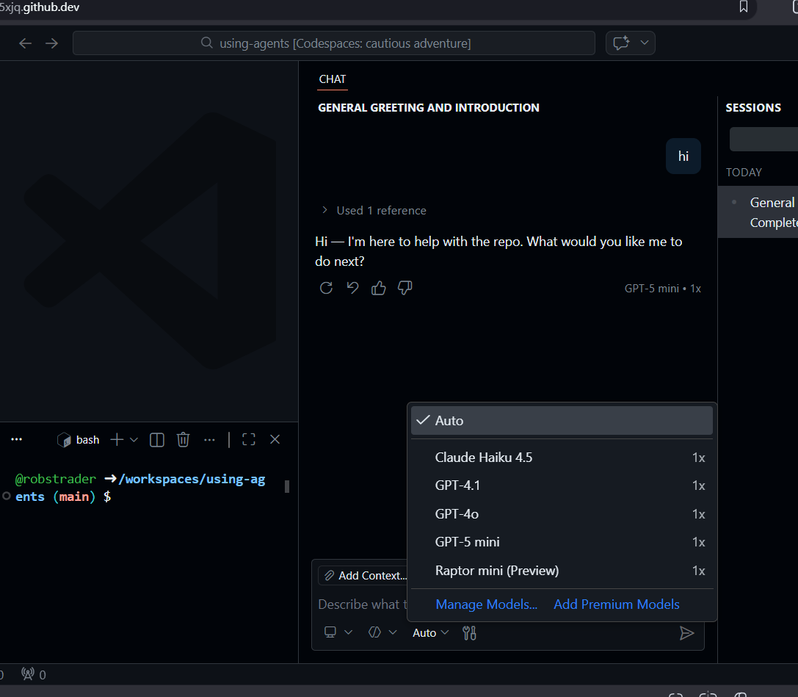
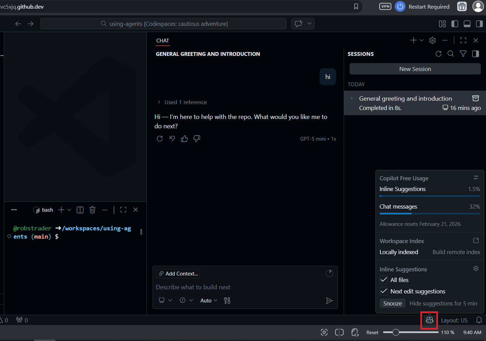

# GitHub Copilot Agent Mode - FAQ

Welcome! If you're new to VS Code and GitHub Copilot Agent Mode, you're in the right place. Think of the Agent as a highly capable research and writing assistant that can help you gather information, create documents, and organize your project.

## What is GitHub Copilot Agent Mode?

Agent Mode is an AI assistant that works independently to help you achieve larger goals. Instead of just answering a single question, it can take on tasks like reading through your project files, searching the web for information, and generating or formatting documents step by step.

## What kind of tasks can it help with?

Agent Mode is incredibly useful for writing and research. You can ask it to:

- **Research topics:** "Search the web for the latest trends in our project topic and summarize them."
- **Draft documents:** "Write a project proposal based on our meeting notes."
- **Organize information:** "Read all the text files in this folder and create an index of key terms."
- **Review and edit:** "Check this document for clarity and suggest improvements to the tone."

## How do I use a specific tool?

Sometimes you want the Agent to use a specific capability (a "tool"). For example, you might want it to search the internet or read a specific file.
- You can explicitly ask in your prompt: "Search the web for [topic]" and the Agent will know to use its web search tool.
- You can also type `#` and type the name of the tool, for example `#web`. 

### How do I know what tools are available?

You can see the list of tools available if you click the following button:

That will open a menu where you can see a list of available tools:

## How do I change my model?

Different AI models have different strengths. You can switch between them directly in VS Code:
1. Look for the model drop-down menu in the Copilot Chat:

2. Click on it to see a list of available models.

3. Select the one you want to use for your current task.

## Which model is best?

*I actually don't know what models you have access to. Send me a list, and I should be able to provide some guidance.*

## How do I know how many premium requests I have left?

High-powered models use what are called "premium requests."
- **Where to check:** You can hover on the Copilot icon in the bottom right corner of your VS Code window (in the status bar). This will show you how many premium requests you have left.

- **What happens when you run out:** If you reach your limit, Copilot will seamlessly fall back to a standard model(*I think this is the case. Need clarification here, not sure how the student accounts work*). While standard models are still great for basic writing and summarizing, they might not be quite as capable at complex logic or deep research.

## Can the Agent make mistakes?

Yes! Just like a human assistant, it can misunderstand your prompt or include inaccurate information from the web. Always remember to:
- Review any generated documents before finalizing them.
- If it writes something incorrectly, just tell the Agent how to fix it! "Make the tone of this paragraph more professional" or "You misunderstood my point about X, please rewrite it."
- You are in control; the Agent is simply there to help you draft and research more efficiently.
